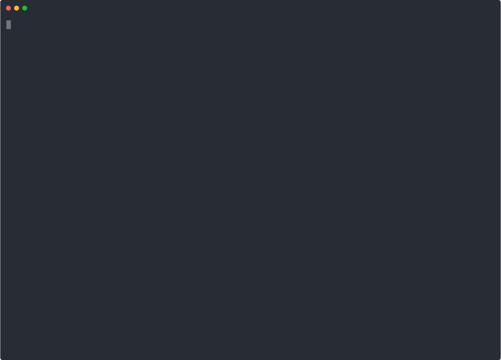

# `zot` demos

## Getting Started

### As a Developer

### As a User (datapath)

#### Using `docker` runtime

#### Using `podman` runtime

#### push/pull using `skopeo`

#### push/pull using `oras`

## Image Signatures

### [`notation`](https://github.com/notaryproject/notation)

### [`cosign`](https://github.com/sigstore/cosign)

