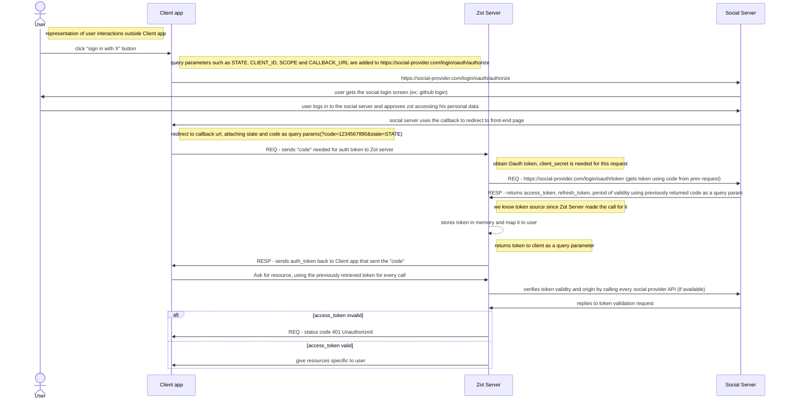
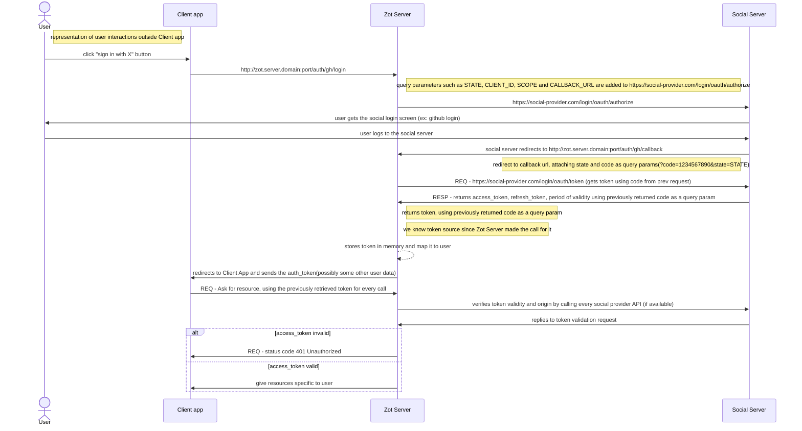
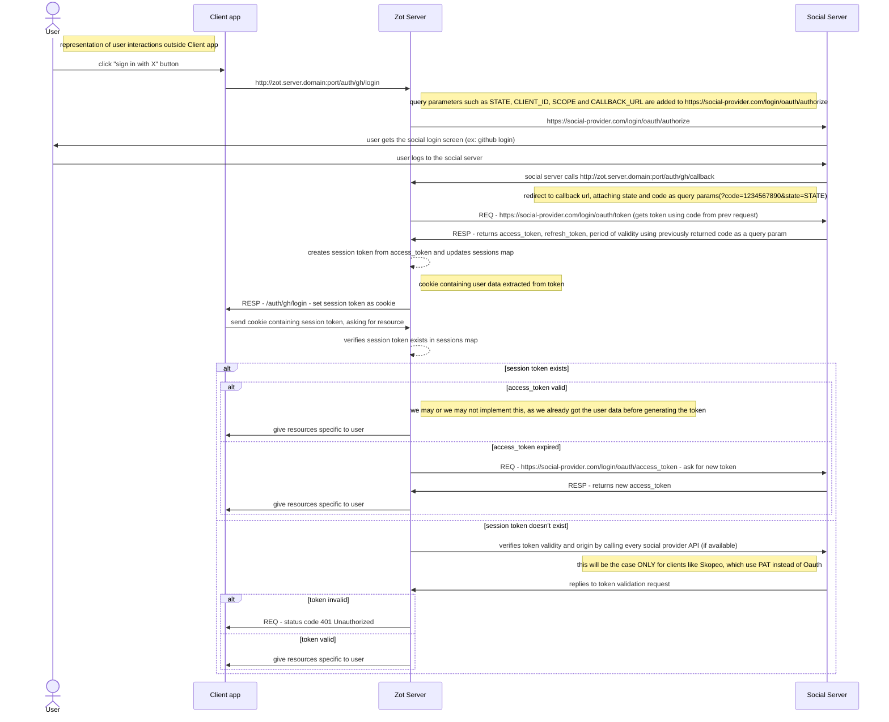
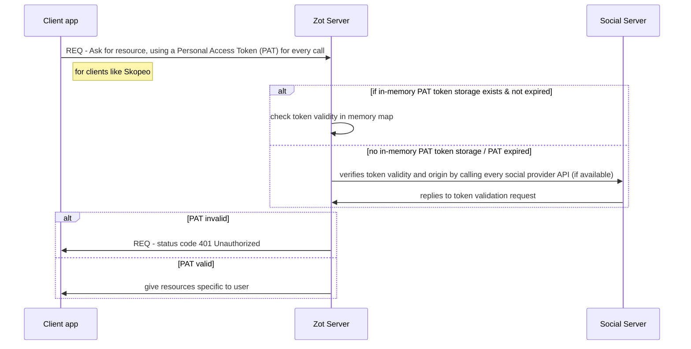

# Social login flow

This document describes our implementation options for implementing social login in zot
By social login we understand login with a Github/Gitlab/Google account.
The social login feature leverages OAuth2 infrastructure implemented by the social login provider.
Note not all social login providers implement all OAuth2 flows, and there are differences in implementation.
If we are to support these 3 providers we need to take this into consideration.

## OAuth2 flows for UI

There are several OAuth2 flows we looked at:

* Authorization Code Flow

    * https://oauth.net/2/grant-types/authorization-code/
    * https://datatracker.ietf.org/doc/html/rfc6749
    * This is for server-side apps making calls to social login providers,
    most of the logic would be in zot code itself
    * The zot code would need a `client_id` and `client_secret` in order to access
    the social login provider and request a `code`. Based on this `code` the
    zot server would make another request to get the `token`, which it would
    later pass to zui as a query parameter. The workflow itself is more complex
    but the basic idea is that we need a `client_secret` for athentication, which is not
    safe to send to zui, save in zui code, or store in the browser.
    * We would need to implement specific endpoints for login for each social login provider
    or zui to send us the social provider name/id to a single login endpoint which we implement
    specifically for oauth
    * We would also need to implement a callback endpoint in zot, which is where the social login
    provider would redirect the browser after the user authorized our app to access his data

* Implicit Flow

    * https://datatracker.ietf.org/doc/html/rfc6749
    * https://oauth.net/2/grant-types/implicit/
    * This flow was supposed to be for browser-based single-page apps, but is now legacy for security reasons
    * This could theoretically be implemented without needing a `client_secret` browser-side

* PKCE Flow

    - https://datatracker.ietf.org/doc/html/rfc7636
    - https://oauth.net/2/pkce/
    - This could theoretically be implemented mostly in the browser without needing a `client_secret`
    accessible there
    - This flow is not supported by all social login providers we take into consideration - it's supported
    on GitLab, but not on GitHub

Given the limittations of the flows above, we are limitted with regards to options if we want all 3 to work.
Login with GitHub requires an implementation of the Authorization Code Flow, which implies more zot server side code. 

## Data-Path login

The above is mostly applicable for zot UI side.
For Data-Path, we can use personal token from GitHub. We could investigate further to see how we could obtain
GitLab or Google tokens.
Given the GitHub token is already generated, we can jump straight to validating it on zot side.

## Observations on validating an existing token and user permissions

* Currently we don't have a way to identify what social login provider was used when we receive a token by just inspecting it's string.
The GitHub token is prefixed with `gh` (`gho_*` for oauth2 token and `ghp_*` for personal tokens),
but there is no similar convention for other providers.
* Also we don't have a way to decode the tokens, in order to verify it's validity/permissions
* If the user has a choice of multiple providers, we would need to check in the backend by validating it against
all configured providers.

Someone suggested custom headers on requests from frontend to specify token type (github/google/gitlab), but
this would only work for zot UI, and not for the data path.

In order to validate a token there is no straight forward way to make a standard call, it depends on the provider.
For example GitHub provides a non-rate-limitted API for validating oauth2 `gho_*` tokens,
but there is no such API for personal `ghp_*` tokens.

This means we have to call another rate-limitted API to check if login with said token works on GitHub, or
the social login provider in general.
We need to find a way around this.

One option is to keep the tokens in memory or in a database (just the valid one, or also the invalid ones?).
This way we won't hit the rate limitting. If we go with this implementation. we can store the refresh token and the token generation timestamp in the DB too, then if the active token expires, perform the token refresh flow. It would
still reduce the need to query the possibly rate-limited social provider while keeping the token valid. Note we also
need to consider the case of PAT, for which we don't have a token refresh or expiry information, for PATs
we can set an default expiration time of a few minutes or more during which the token is considered valid.
Another possible solution would be to validate the tokens once, and then use a different token which we emit
ourselves or a cookie - at least for zot UI side.

In order to identify unique users who can access zot using multiple social logins, the proposal is to use
their `emails` as unique identities.

In all cases we would need to store the user the token belongs to, along his permissions, on zot side.
We still need to store users, but not their passwords.

There is also the matter of the token reToken refresh logic
    - implemented on frontend
    - implemented on backend
If we stick to Authorization Code Flow by the book, it would be implemented on the backend. 

This is unless we want to externalize everything, have a different service handling social login, and that server
would be responsible for generating JWT tokens which include user permissions, with minimal additional changes on zot server side.

## UI design observations

How auth is displayed:
    - Social auth page in Popup
    - Redirect to social auth page

## Implementation options

We should decide which of the ones below we wan to proceed with

### 1 Frontend based

#### Short overview of the workflow

Implements OAuth2 Authorization Code Flow, partially on frontend, partially on backend.
Obtaining the `code` is done in the frontend, but obtaining the token itself is done in the backend.
This is the most we can move to frontend if we are to support GitHub authentication.

    - Frontend: click "sign in with X" button
    - Frontent redirects to social auth (from selected social provider)
    - User approves access to his data
    - Social auth redirects after login to frontend page
    - Frontend sends auth verification `code` to backend (which get the `token` from GitHub based on the code)
    - Frontend receives `token`(possibly user data as well, depending on provider)
    - Frontend uses `token` to auth
    - Backend checks `token` validity on every call made by the UI

#### zui needs the following features from the zot backend

    - New zot endpoint that receives `code` and responds with `token` (+some verification data)
    this endpoint would allow the client to specify a social login provider, or we need multiple
    separate enpoints one for each social login provider
    - Zot need to support token verification logic in the backend (on requests made by UI)
    - Logic mentioned in the `Observations on validating an existing token and user permissions` section
    of this document

#### Sequence diagram for this workflow



### 2 Backend based

#### Short overview of the workflow

    - Frontend: click "sign in with X" button
    - Backend redirects to social auth page (from social provider)
    - Social auth redirects after login to backend callback with `code`
    - Backend handles obtaining `token` based on `code`
    - Backend redirects after callback to frontend page, passing auth `token` to frontend
    - Frontend receives `token` (possibly user data as well, depending on provider)
    - Frontend uses `token` to auth
    - Backend checks `token` validity

#### zui needs the following features from the zot backend

    - New endpoints for login to social authentication provider.
    Or a single endpoint which would allow the client to specify a social login provider.
    - New endpoints for social provider callbacks (where the user would be redirected after authorizing
    the zot app)
    - Logic mentioned in the `Observations on validating an existing token and user permissions` section
    of this document

#### Sequence diagram for this workflow



### 3 UI to use token generated by zot

#### Short overview of the workflow

    - First steps same as flow#1 and flow#2
    - Backend validates social token
    - Backend generates it's own JWT token which includes user permissions, sends to frontend
    - Frontend uses the token generated by zot for auth instead of the token from the social provider
    - If we do this right, for zot UI we will call the social login provider APIs only once per UI user
    - Other clients (Skopeo) will be using the flow at #5

#### zui needs the following features from the zot backend

    - Same as #1 or #2 with the exception of custom header, token verification logic on endpoint instead of request
    - Own bearer authentication logic, bearer login api and jwt generation
    (can be self-signed for dev, needs external service for prod)
    - We could implement the authentication/authorization logic as a separate service  

#### Sequence diagram for this workflow

 ```mermaid
    sequenceDiagram
        actor User
        Note right of User: representation of user interactions outside Client app
        participant Client app
        participant Zot Server
        User ->> Client app: click "sign in with X" button
        Client app->>Zot Server:  http://zot.server.domain:port/auth/gh/login
        Note right of Zot Server: query parameters such as STATE, CLIENT_ID, SCOPE and CALLBACK_URL are added to https://social-provider.com/login/oauth/authorize
        Zot Server->>Social Server:  https://social-provider.com/login/oauth/authorize

        Social Server ->> User: user gets the social login screen (ex: github login) 
        User ->> Social Server: user logs to the social server
        Social Server ->> Zot Server: social server calls http://zot.server.domain:port/auth/gh/callback
        Note left of Social Server: redirect to callback url, attaching state and code as query params(?code=1234567890&state=STATE)
        Zot Server ->> Social Server: REQ - https://social-provider.com/login/oauth/token (gets token using code from prev request)
        Social Server ->> Zot Server: RESP - returns access_token, refresh_token, period of validity using previously returned code as a query param
        Note right of Zot Server: returns token, using previously returned code as a query param
        Note right of Zot Server: we know token source since Zot Server made the call for it
        Zot Server ->> Zot Server : create own JWT token to be sent to Client app with permission information
        alt implement storing the token
        Zot Server ->> Zot Server : stores own JWT token in memory and map it to user&auth_token of origin
        else do not imeplement storing the token include user data
        Zot Server ->> Zot Server : in this case the JWT token also needs to include all required user data to be used later
        else do not imeplement storing the token include original token
        Zot Server ->> Zot Server : in this case the JWT token also needs to include original token in order to identify the user later
        end
        Zot Server ->> Client app: redirects to Client App and sends the Zot Server generated JWT token
        Client app ->> Zot Server: REQ - Ask for resource, using the Zot Server generated token for every call
        Note right of Client app: or using PAT token for clients like Skopeo
        alt if token storage is implemented
        Zot Server ->> Zot Server: check user information according to memory map
        else no token storage is implemented and zot token contains user data
        Zot Server ->> Zot Server: decrypt Zot server generated token and extract user specific data
        else no token storage is implemented and zot only contains original token
        Zot Server ->> Zot Server: decrypt Zot server generated token and extract underlying auth_token, obrain information from auth providers
        Zot Server ->> Social Server : verifies token validity and origin by calling every social provider API (if available)
        Social Server ->> Zot Server : replies to token validation request
        end
        Note left of Social Server: this verification will also be done for clients like Skopeo, which use PAT instead of Zot tokens
        alt token invalid
            Zot Server ->> Client app: REQ - status code 401 Unauthorized
        else token valid
            Zot Server ->> Client app: give resources specific to user
        end
```

### 4: Backend with session cookies

#### Short overview of the workflow

    - Similar to flow#3
    - Instead of generating JWT tokens use sessions to store information
    - If we do this right, for zot UI we will call the social login provider APIs once per user when we generate a token, and later only when we need to refresh it.
    - Other clients (Skopeo) will be using the flow at #5

#### zui needs the following features from the zot backend

    - Endpoints needed are the same as flow #3.
    - Needs session tracking on zot side.

#### Sequence diagram for this workflow



### 5: Client Apps that don't integrate with Oauth and use PATs

#### Short overview of the workflow

This flow will be used for the Data Path (using Skopeo or similar tools)
in combination with any of the previous flows.

#### zui needs the following features from the zot backend

Validate the tokens and give access based on user
See details in section `Observations on validating an existing token and user permissions`

#### Sequence diagram for this workflow


