# Store and access Repository, Image and User metadata in a consistent way.

## Problem statement

Store and access Repository, Image and User metadata in a consistent way.

In the context of the zot web-based user interface, the need has arissen to provide an API to query information across multiple container image repositiories in a simple and efficient manner.
On top of this, there is a growing need to store and access additional data, which is not part of the OCI specifications, such as User metadata, or such as Image download counters.
This RFC documents a proposal to solve this challenge, it defines the user-facing GraphQL API, the interface between the DataBase and the GraphQL resolvers, as well as format in which the data is stored in the DataBase.

## Solution 

Out solution summary can be described in the following diagram:


We'll first discuss the user-facing GraphQL API described by the following schema

```GraphQL
type Query {
     CVEListForImage(image: String!): CVEResultForImage!
     
     # Given a repo return all contained images
     ImageList(repo: String!, requestedPage: PageInput): PaginatedImagesResult!  
     
     # Given a CVE ID retuns all affected images
     ImageListForCVE(id: String!, requestedPage: PageInput): PaginatedImagesResult!  
     
     # Given a CVE ID retun images in which the CVE has been fixed
     ImageListWithCVEFixed(id: String!, image: String!, requestedPage: PageInput): PaginatedImagesResult! 
     
     # Given a digest string return images which contain the blob with this digest
     ImageListForDigest(digest: String!, requestedPage: PageInput): PaginatedImagesResult!  
     
     # Given a layer digest return images which contain it
     ImageListForLayer(digest: String!, requestedPage: PageInput): PaginatedImagesResult!  
     
     # Given an ascendant image, identify descendent images
     ImageListForAscendantImage(image: String!, requestedPage: PageInput): PaginatedImagesResult!  
     
     # Given a descendant image, identify ascendant images
     ImageListForDescendantImage(image: String!, requestedPage: PageInput): PaginatedImagesResult!  
     
     # Obtain detaled information on a repo and contained images
     ExpandedRepoInfo(repo: String!): RepoInfo!  
     
     # Return all images/repos/layers which match the query
     GlobalSearch(query: String!, requestedPage: PageInput): GlobalSearchResult!  
     
     # Newest based on created timestamp
     RepoListWithNewestImage(requestedPage: PageInput): PaginatedReposResult!  
     
     # Assuming the user is obtained from context object
     BookmarkedRepos(requestedPage: PageInput): PaginatedReposResult!  
}
```
The payload is describes by the following structures:

```GraphQL
type RepoInfo {
     Images: [ImageSummary]
     Summary: RepoSummary
}

# Search results in all repos/images/layers
# There will be other more structures for more detailed information
# If limit is -1, pagination is disabled
type GlobalSearchResult {
     Page: PageInfo
     Images: [ImageSummary]
     Repos: [RepoSummary]
     Layers: [LayerSummary]
}

# Brief on a specific image to be used in queries returning a list of images
# We define an image as a pairing or a repo and a tag belonging to that repo
type ImageSummary {
     RepoName: String
     Tag: String
     Digest: String
     ConfigDigest: String
     LastUpdated: Time
     IsSigned: Boolean
     Size: String
     Platform: OsArch
     Vendor: String
     Score: Int
     DownloadCount: Int
     Layers: [LayerSummary]
     Description: String
     Licenses: String  #  The value of the annotation if present, 'unknown' otherwise).
     Labels: String
     History: [HistoryEntry]
}
# ToDo: add reference to signature information

type HistoryEntry {
     Author: String
     Created: Time
     CreatedBy: String
     EmptyLayer: Boolean
}

# Brief on a specific repo to be used in queries returning a list of repos
type RepoSummary {
     Name: String
     LastUpdated: Time
     Size: String
     Platforms: [OsArch]
     Vendors: [String]
     Score: Int
     NewestImage: ImageSummary # Newest based on created timestamp
     DownloadCount: Int
     StarCount: Int
     IsBookmarked: Boolean
     IsStarred: Boolean
}
# ToDo: add Logo field
# ToDo: add Description field

enum SortCriteria {
     RELEVANCE
     UPDATE_TIME
     ALPHABETIC_ASC
     ALPHABETIC_DSC
     STARS
     DOWNLOADS
}

# Information on current page returned by the API
# ObjectCount represents the total number of objects on all pages
# PreviousPage represents previous page number
# NextPage represents next page number
# Pages represents total number of pages
type PageInfo {
     ObjectCount: Int!
     PreviousPage: Int
     NextPage: Int
     Pages: Int
}

# Pagination parameters
input PageInput {
  limit: Int
  offset: Int
  sortBy: SortCriteria
}

# Paginated list of RepoSummary objects
# If limit is -1, pagination is disabled
type PaginatedReposResult {
     Page: PageInfo
     Results: [RepoSummary!]!
}

# Paginated list of ImageSummary objects
# If limit is -1, pagination is disabled
type PaginatedImagesResult {
     Page: PageInfo
     Results: [ImageSummary!]!
}
```

### RepoDB

In order to serve quickly all the information required by the new API, we can't rely anymore on searching direcly into the Zot storage so we come with the proposal of a database responsable of general information about repositories. We discribe this database with an interface: 

```Go
type RepoDB interface {
    # Repo level specific calls
    
    // SetRepoDescription sets the repo description
    SetRepoDescription(repo, description string) error
    
    // IncrementRepoStars adds 1 to the star count of an image
    IncrementRepoStars(repo string) error
    
    // IncrementRepoStars substracts 1 from the star count of an image
    DecrementRepoStars(repo string) error

    // GetRepoStars returns the total number of stars a repo has
    GetRepoStars(repo string) (int, error)
    
    // SetRepoLogo sets the path of the repo logo image
    SetRepoLogo(repo string, logoPath string) error
    
    // SetRepoTag sets the tag of a manifest in the tag list of a repo
    SetRepoTag(repo string, tag string, manifestDigest string) error
    
    // DeleteRepoTag delets the tag from the tag list of a repo
    DeleteRepoTag(repo string, tag string) error
    
    // GetRepoMeta returns RepoMetadata of a repo from the database
    GetRepoMeta(repo string) (RepoMetadata, error)
    
    // GetMultipleRepoMeta returns information about all repositories as []RepoMetadata filtered by the filter function
    GetMultipleRepoMeta(filter func, requestedPage PageInput) ([]RepoMetadata, error)

    # Manifest level specific calls
    // GetManifestMeta returns ManifestMetadata for a given manifest from the database
    GetManifestMeta(manifestDigest string) (ManifestMetadata, error)
    
    // GetManifestMeta sets ManifestMetadata for a given manifest in the database
    SetManifestMeta(manifestDigest string, mm ManifestMetadata) error
    
    // IncrementManifestDownloads adds 1 to the download count of a manifest
    IncrementManifestDownloads(manifestDigest string) error
    
    // AddManifestSignature adds signature metadata to a given manifest in the database 
    AddManifestSignature(manifestDigest string, sm SignatureMetadata) error
    
    // AddManifestSignature delets signature metadata to a given manifest from the database
    DeleteSignature(signatureDigest string) error
    
    // AddManifestDependant adds a manifest to the dependants lists of a image
    AddManifestDependant(manifestDigest string, dependantDigest string) error
    # Search
    // SearchRepos searches for repos given a search string
    SearchRepos(searchText string, requestedPage PageInput) ([]RepoMetadata, map[string]ManifestMetadata, error)
    
    // SearchRepos searches for images(repo:tag) given a search string
    SearchTags(searchText string, requestedPage PageInput) ([]RepoMetadata, map[string]ManifestMetadata, error)  # note the RepoMetadata object may have an incolete number of tags, as the tags are counted/paginated.
    
    // SearchRepos searches for digests given a search string
    SearchDigests(searchText string, requestedPage PageInput) ([]RepoMetadata, map[string]ManifestMetadata, error)  # note the RepoMetadata object may have an incolete number of tags, as the digests are counted/paginated.
    
    // SearchRepos searches for layers given a search string
    SearchLayers(searchText string, requestedPage PageInput) ([]RepoMetadata, map[string]ManifestMetadata, error)  # note the RepoMetadata object may have an incolete number of tags, as the layer digests are counted/paginated.
    
    // SearchRepos searches for ascendant images given a search string
    SearchForAscendantImages(searchText string, requestedPage PageInput) ([]RepoMetadata, map[string]ManifestMetadata, error) # note the RepoMetadata object may have an incolete number of tags, as the layer digests are counted/paginated.
    
    // SearchRepos searches for descendant images given a search string
    SearchForDescendantImages(searchText string, requestedPage PageInput) ([]RepoMetadata, map[string]ManifestMetadata, error) # note the RepoMetadata object may have an incolete number of tags, as the layer digests are counted/paginated.

}

type ManifestMetadata struct {
	ManifestBlob  []byte
	ConfigBlob    []byte
	DownloadCount int
	Signatures    map[string][]string
	Dependencies  []string
	Dependants    []string
	BlobsSize     int
	BlobCount     int
}

type RepoMetadata struct {
    Tags         map[string]string
    Signatures   []string
    Stars        int
    Description  string
    LogoPath     string
}

type SignatureMetadata struct {

}

type PageInput struct {
	Limit        int
	Offset       int
	SortBy       SortCriteria
}
```

### Request workfow
By adding the new GraphQL requests and the new interraction with the RepoDB the behaviour of the Zot rest handlers and GraphQL resolvers have changed. The more interesting changes will be presented in workflow diagrams. 


#### BookmarkedRepos
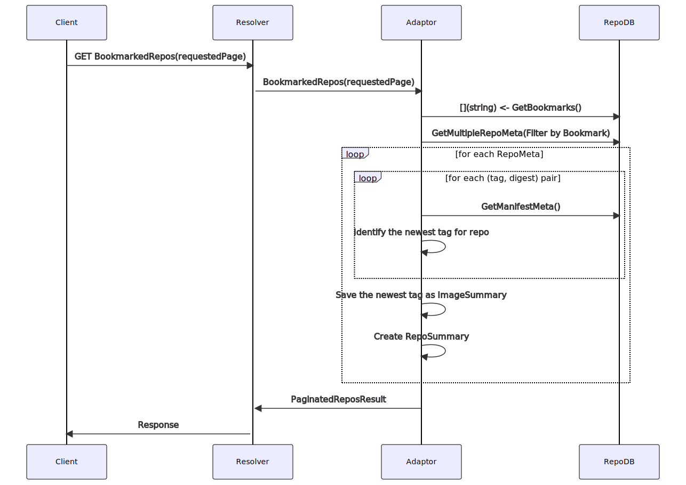

#### GetManifest
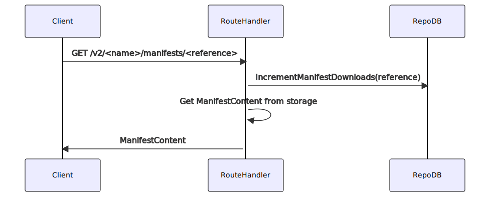

#### PutManifest
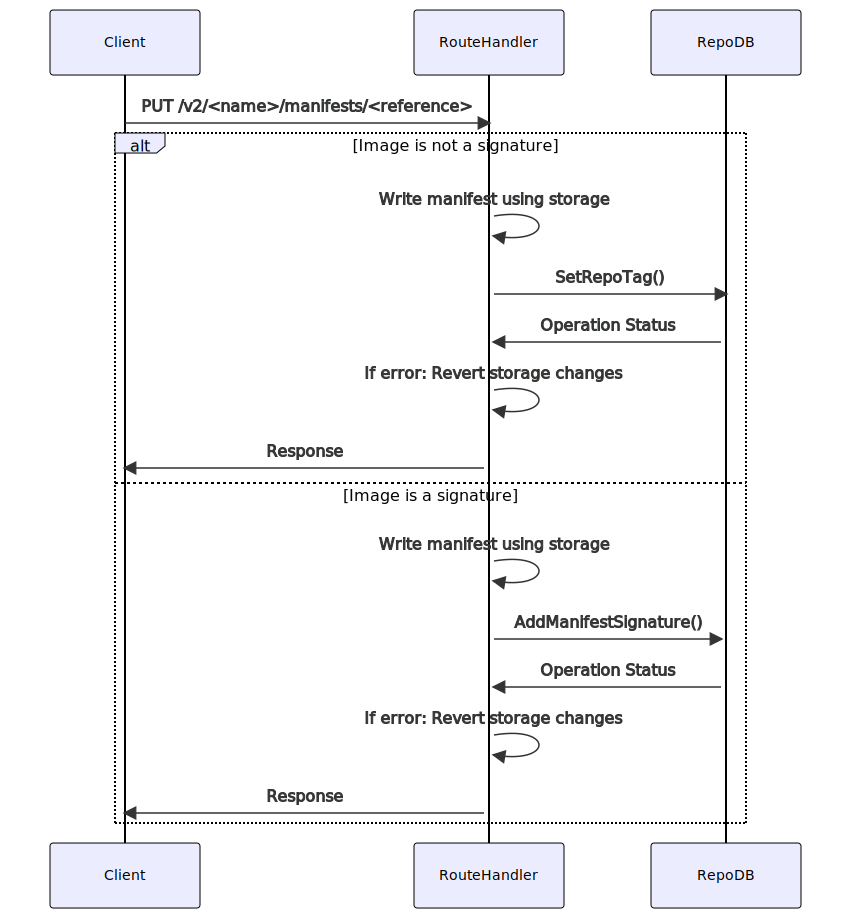

#### DeleteManifest
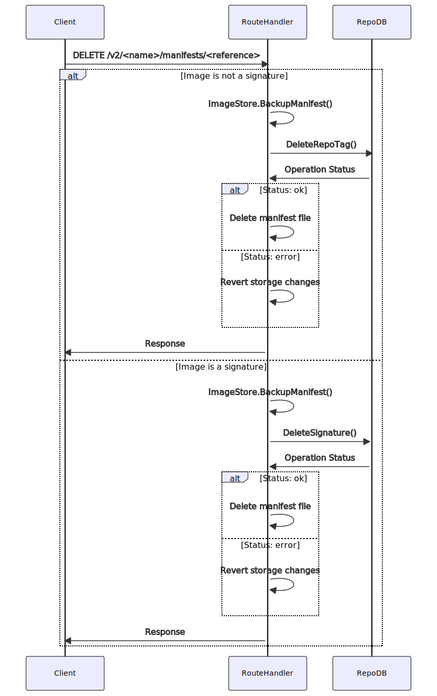

#### ExpandedRepoInfo
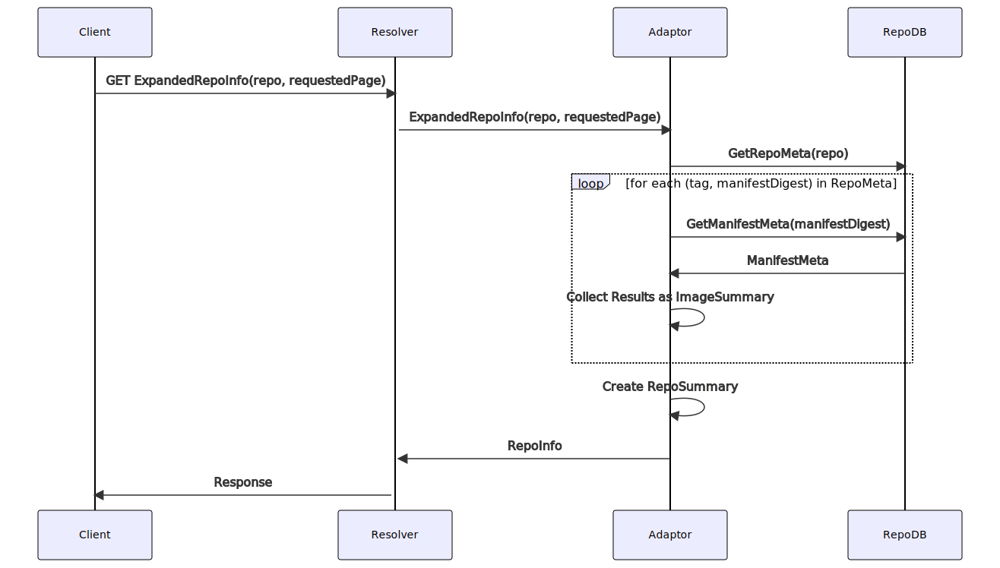

#### GlobalSearch
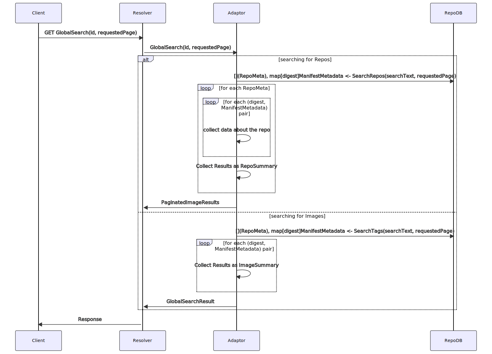

#### ImageList
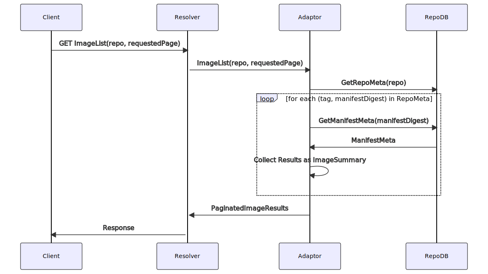

#### ImageListForAscendantImage
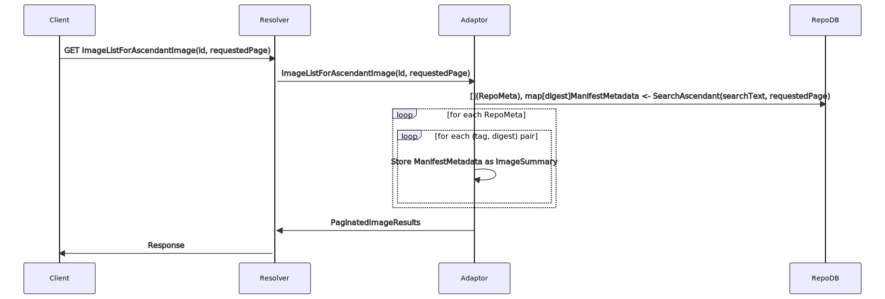

#### ImageListForCVE
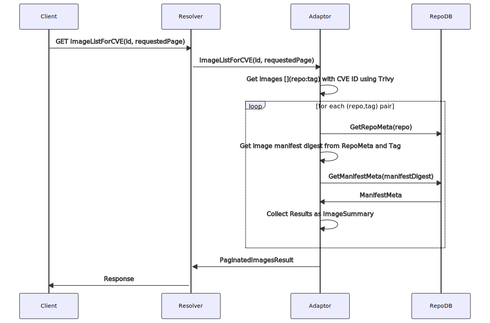

#### ImageListForDescendantImage
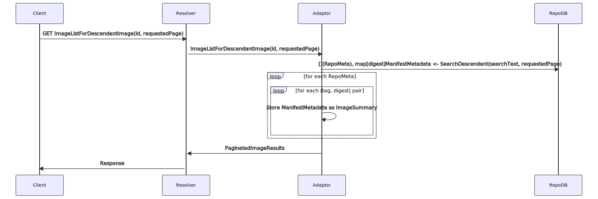

#### ImageListForDigest
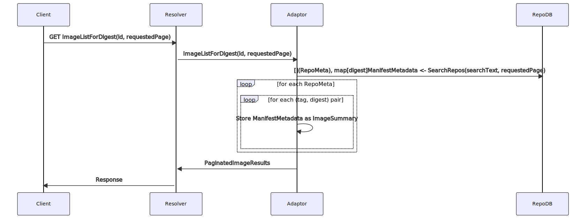

#### ImageListForLayer
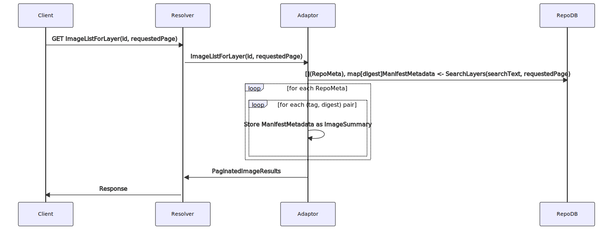

#### ImageListWithCVEFixed
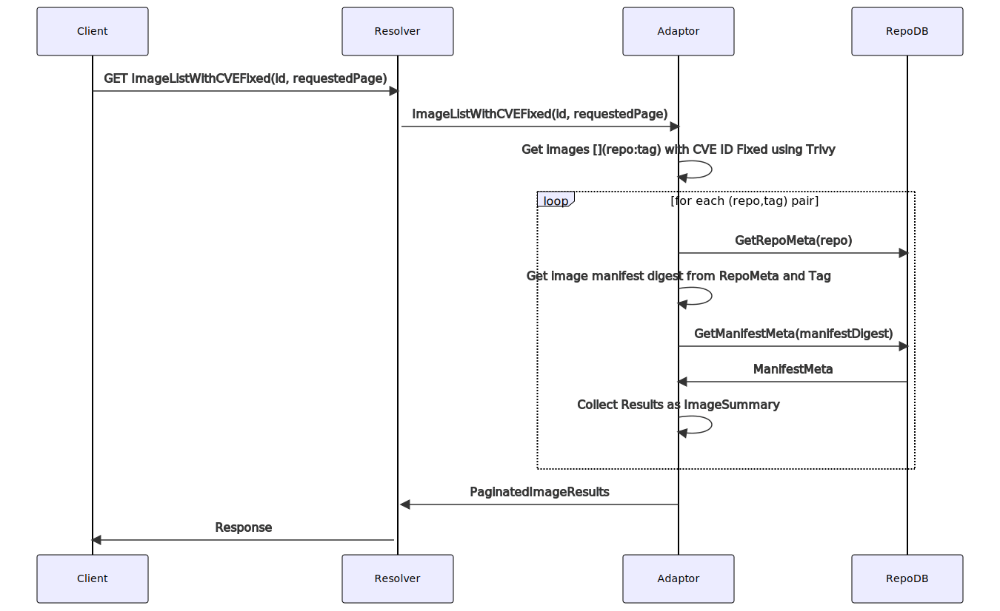

#### RepoListWithNewestImage
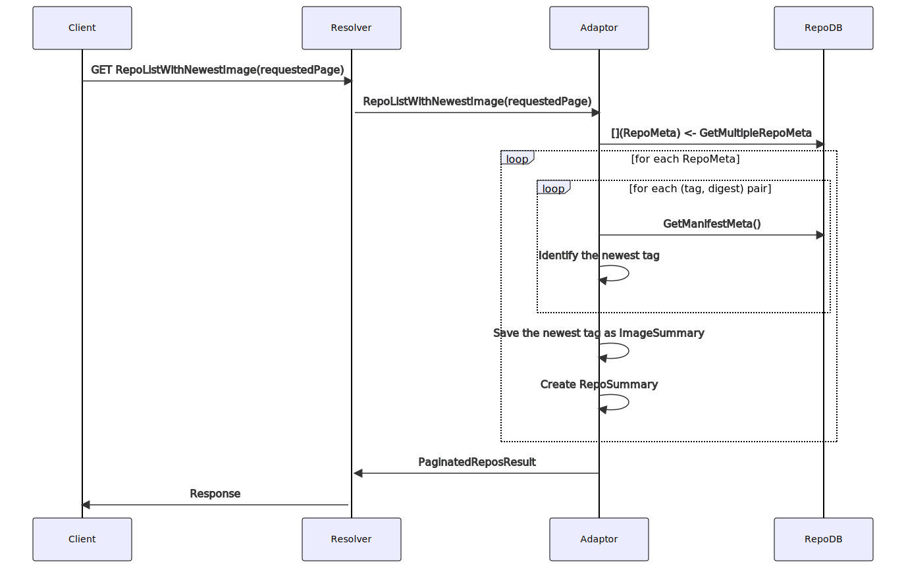

#### StarredRepos
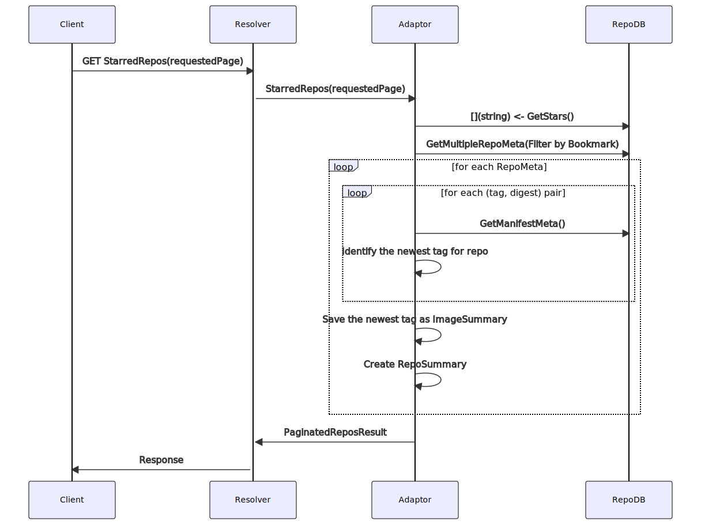

### RepoDB Implementation

We propose to use BoltDB to offer the functionality required by the RepoDB interface. We have defined the following buckets:

ImageMetadata Bucket

```yaml
<string>: # ManifestDigestHash
  ManifestContent: {} # Value is content of the manifest file on the disk
  ConfigContent: {} # Value is content of the config blob on the disk 
  DownloadCount: <int> # Number of total downloads of this particular manifest
  # WeeklyDownloadCount: <int> # Number of weekly downloads of this particular manifest
  # Downloads: []<datetime> # List of dates and times when the manifest was downloaded, alternative to counters?
  Signatures: []<string> # List of digests of signatures
  Dependencies: <string> # List of digests of manifests sharaing all theor layers with this manigest
  Dependants: <string> # List of digests of manifests which include all the layers of this manigest
  BlobsSize: <int> # Total size of blobs belonging to the manifest (manifests+config+layers)
  BlobCount: <int> # Total number of blobs belonging to this manifest
```

SignatureMetadata Bucket

```yaml
<string>: # ManifestDigestHash
  ManifestContent: {} # Value is content of the manifest file on the disk
  ConfigContent: {} # Value is content of the config blob on the disk 
  BlobsSize: <int> # Total size of blobs belonging to the manifest (manifests+config+layers)
  BlobCount: <int> # Total number of blobs belonging to this manifest
```

RepoMetadata Bucket

```yaml
<string>: # Repo name
  Tags:
    <string>: <string> # Tag name as key, Manifest Digest as value
  Stars: <int> # Number of users who starred the repo
  Description: <string> # Description shown for a repo in UI
  LogoPath: <string> # Logo shown for a repo in the UI
```

UserMatadata Bucket

```yaml
<string>: # User name
  Bookmarks: []<string> # Names of repos which were bookmarked
  Stars: []<string> # List of respos stared by this user
  APIKey: <string> # API Key generated by this user
```

[//]: # (This is a comment, it will not be included)
