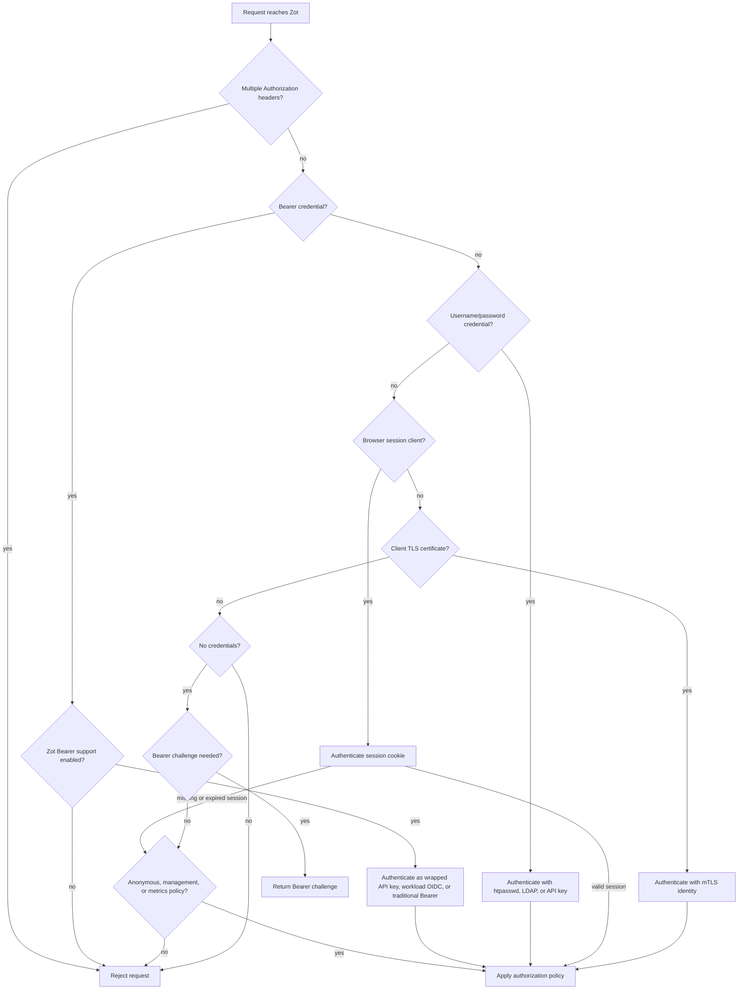

# Combined Authentication

This document summarizes how Zot behaves when more than one authentication method is enabled for the same registry.

Zot selects the authentication path from the credential style used by the client. This lets browsers, command-line OCI clients, CI systems, and in-cluster workloads share one registry without forcing every client through the same login protocol.

## Supported Combinations

| Configuration | Supported | Behavior |
| --- | --- | --- |
| `htpasswd` and `ldap` | Yes | Clients send username/password credentials. Zot accepts the request when one configured passphrase backend validates the credentials. |
| `openid` and `apikey` | Yes | Users sign in through browser SSO, then create API keys for Docker, Podman, containerd, kubelet, scripts, and other non-browser clients. |
| `openid`, `apikey`, and `bearer` challenge settings | Yes | OCI clients can exchange API keys for wrapped Bearer credentials, while browser users continue using SSO sessions. |
| `bearer.oidc` and `openid` | Yes | Workloads use OIDC tokens as Bearer credentials; humans use browser SSO sessions. |
| `bearer.oidc` and `apikey` | Yes | Workloads can use secret-less OIDC tokens, while users or automation that cannot get workload tokens can use API keys. |
| `bearer.oidc` and traditional Bearer JWTs | Yes | Zot tries locally trusted workload OIDC tokens first. Traditional Bearer JWTs still work when configured with a certificate or AWS Secrets Manager verification keys. |
| `bearer.oidc` and an external token service | Yes | Advertise Zot's `/zot/auth/token` endpoint and set `upstreamTokenEndpoint` so Zot can forward only token requests that do not belong to a local Zot credential source. |
| `mtls` with other authentication methods | Yes | Client certificates remain available as a separate credential style for clients that present TLS certificates. |
| Anonymous policies with authentication | Yes | Requests without credentials can be allowed by anonymous, management, or metrics policy. Invalid `Authorization` credentials are rejected; browser UI clients with a missing or expired session may still use anonymous policy when configured. |
| Multiple `Authorization` headers | No | Zot rejects these requests to avoid ambiguous credential handling. |

## Request Flow



## Challenge Advertisement

When Zot rejects a request or asks an OCI client to retry with credentials, the advertised challenge is selected from the server configuration rather than from the credential style the client tried to use.

| When | Challenge |
| --- | --- |
| Bearer challenge settings can be advertised, and Bearer OIDC, traditional Bearer, or API keys are enabled | `WWW-Authenticate: Bearer ...` |
| Otherwise, when htpasswd, LDAP, or API-key Basic authentication is available | `WWW-Authenticate: Basic ...` |
| Browser UI session clients | No `WWW-Authenticate` challenge; UI authentication and authorization responses suppress it. |
| Local token-exchange rejection by Zot's token endpoint | `WWW-Authenticate: Basic ...` for the token endpoint realm |

## Token Exchange Behavior

OCI clients usually start by requesting `/v2/`. If Zot advertises a Bearer challenge, the client then calls the advertised token endpoint and retries the registry request with the returned Bearer credential.

In mixed deployments, Zot should be the advertised token endpoint:

```json
{
  "http": {
    "auth": {
      "bearer": {
        "realm": "https://zot.example.com/zot/auth/token",
        "service": "zot.example.com",
        "upstreamTokenEndpoint": {
          "realm": "https://auth.example.com/token",
          "service": "legacy-token-service"
        }
      }
    }
  }
}
```

Zot successfully exchanges these token requests locally:

- API keys that start with Zot's API-key prefix.
- OIDC workload tokens trusted by `bearer.oidc`.

Zot also recognizes these credentials as locally owned and refuses to forward them:

- Wrapped API-key Bearer credentials issued by Zot, regardless of whether a client sends them as a Bearer credential, username/password secret, or form credential. They are already Bearer credentials for registry requests, so the token endpoint rejects them with `401 Unauthorized` instead of minting another token or proxying the request.
- Browser OpenID/OAuth2 tokens from configured `openid.providers`. These are for the browser login flow, not the OCI token service flow, so the token endpoint rejects them locally.

If a token request does not belong to any local Zot credential source, Zot can forward it to `upstreamTokenEndpoint`. This preserves compatibility with an existing external token service while keeping Zot-owned credentials local.

## Real-World Scenarios

### Browser SSO and CLI Image Pulls

Organizations often want users to sign in to the Zot UI with GitHub, GitLab, Google, Dex, or another OIDC/OAuth2 provider. Docker and Podman cannot complete that browser redirect flow. With `openid` and `apikey` enabled together, the user signs in through the browser, creates an API key in Zot, and uses that key with Docker, Podman, containerd, kubelet image pull secrets, or scripts.

When a Bearer challenge is also configured, those API keys can be exchanged through Zot's token endpoint so OCI clients still use the standard Bearer retry flow.

### Workload Identity for Kubernetes and Flux

Kubernetes workloads can use projected ServiceAccount tokens instead of stored registry passwords. Zot validates those OIDC tokens with `bearer.oidc`, maps their claims to Zot users/groups, and applies normal repository authorization policy.

This supports Kubernetes image pulls and Flux OCIRepository-style integrations where the workload identity, namespace, ServiceAccount, repository, or other claims decide registry access.

### GitHub Actions Without Long-Lived Secrets

GitHub Actions can request short-lived OIDC tokens from GitHub and present them to Zot. Zot validates the GitHub issuer and audience, then uses claim mapping and policy to authorize the workflow. This avoids storing a static registry password in GitHub secrets for workflows that can use OIDC.

### Existing Bearer Token Service Migration

Some deployments already have an external OAuth2 or Docker Registry token service that issues scoped JWTs. Those deployments can add Zot workload OIDC without removing the old token service. Zot advertises its own token endpoint, handles Zot-owned credentials locally, and forwards unknown token requests to the upstream service.

For traditional Bearer JWT verification, Zot can load a static public key/certificate or fetch verification keys from AWS Secrets Manager. AWS Secrets Manager is useful when keys rotate and multiple Zot instances need to share the same verification material.

### Anonymous Mirrors With Protected Pushes

Public or internal mirrors often allow unauthenticated pulls while requiring authentication for pushes or private repositories. Anonymous policy can coexist with the other methods above. Invalid `Authorization` credentials are rejected; browser UI clients with a missing or expired session may still use anonymous policy when configured.

## Related Examples

- [OIDC Workload Identity Authentication](README-OIDC-WORKLOAD-IDENTITY.md)
- [AWS Secrets Manager Bearer Authentication](README-AWS-SECRETS-MANAGER-BEARER-AUTH.md)
- [Main configuration reference](README.md#authentication)
