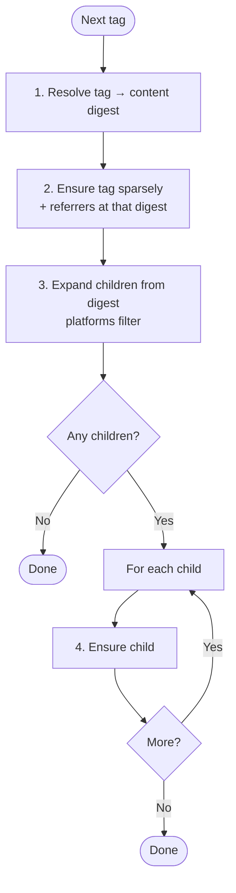
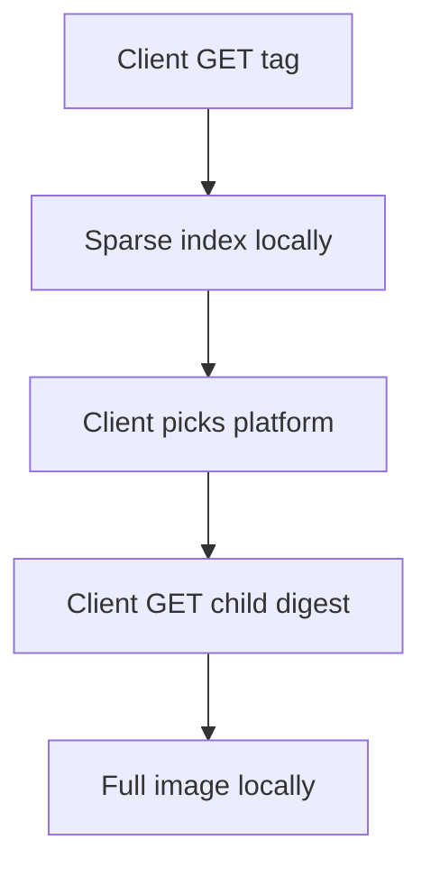
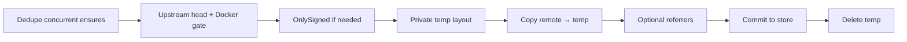

# Sparse multi-arch sync design

How zot sync stores multi-arch indexes **without rewriting their digests**: the full
upstream index is kept, while only selected platform children (plus each child’s config
and layers) are materialized locally.

Goals:

- Periodic sync can limit work with a `platforms` allowlist (registry default, optional
  per-`content` override).
- On-demand sync stays demand-driven: sparse index first, then only digests the client asks for.
- Signatures / referrers that bind to the **index** digest stay valid.

Requires sparse-index tolerance in storage (missing listed children are allowed). A client
GET of a missing child still 404s and may trigger further on-demand sync.

## Configuration

Periodic platform allowlist (on-demand always ignores these lists):

| Source | When used |
|--------|-----------|
| `content[].platforms` | Matching content prefix has the field set (including `[]` = all platforms) |
| `registries[].platforms` | Otherwise |
| (none / empty) | Materialize **all** index children |

| Value | Periodic sync | On-demand sync |
|-------|---------------|----------------|
| Unset at both levels / empty effective list | Materialize **all** index children | Ignored |
| `["linux/amd64", …]` | Materialize only matching children | Ignored |
| Include `""` | Also include descriptors with no platform | Ignored |

Example: registry default `linux/amd64` + `linux/arm64`, with a content override for one family:

```json
"platforms": ["linux/amd64", "linux/arm64"],
"content": [
  { "prefix": "library/**" },
  { "prefix": "special/s390x-app", "platforms": ["linux/s390x"] }
]
```

Entries are `os/arch` or `os/arch/variant` (or bare arch). Validation uses regclient
`platform.Parse`, which keeps only the first three slash-separated tokens — e.g.
`linux/amd64/v1/typo` is accepted as `linux/amd64/v1`. Prefer well-formed entries.
The upstream index is **never** rewritten to a subset of `manifests[]`.

### Docker and `http.compat`

Sync does **not** convert Docker → OCI.

| `http.compat` includes `docker2s2`? | Behavior |
|--------------------------------------|----------|
| No | Docker manifests/lists are rejected early during image sync (skippable; other tags continue) |
| Yes | Docker content is stored as-is (upstream digests preserved) |

Skip checks always use the **upstream** digest. `preserveDigest` is deprecated and ignored;
use `docker2s2` when you need Docker content.

Referrer sync does not use that early Docker gate. Without `docker2s2`, the store may still
reject Docker referrers at commit; those failures are logged and skipped.

### `onlySigned`

When enabled, unsigned images are skipped unless the ensure is allowed to bypass the check.
Signature proof uses the **remote** referrers API (and optional legacy cosign tags) on the
reference being ensured — not local storage.

| Path | Enforced? |
|------|-----------|
| Periodic / on-demand **tag** | Yes |
| Periodic **child digest** (after a signed tag) | No — parent already checked |
| On-demand **digest** pull | No — digests are treated as content-addressed follow-ups |

**Limitation:** any client that knows an upstream digest can sync that manifest without a
per-manifest signature when `onlySigned` is on. Tags still require remote signatures.
Multi-arch signing normally covers the index; requiring referrers on every platform child
would break typical tag→digest client flows.

## Workflows

### Periodic (one tag)

1. Resolve the mutable tag to a content digest once (`TagContentDigest`).
2. Ensure that tag (sparse index or full single-arch image), including referrers, using that
   digest so `ImageCopy` cannot follow a moved tag.
3. Expand index children from the **same** digest (BFS + `platforms` filter); nested
   indexes are expanded the same way.
4. Ensure each selected child digest (images fully; nested indexes sparsely). Children do not
   re-pull referrers.



If the tag is already local with a matching digest, the copy may be skipped, but child
expansion still runs so missing arches can be filled. Referrers still sync when enabled for
that ensure.

### On-demand (typical multi-arch)



`platforms` never gates on-demand. Referrers are pulled separately when the referrers API is hit.

### One ensure session



## Copy behavior

| Kind of reference | What is copied |
|-------------------|----------------|
| Index / manifest list (sparse) | Index only — **no** children |
| Image manifest | Manifest + config + layers |
| Periodic image child | Full image (complete copy) |
| Periodic nested index | Sparse again, then its selected children |

On-demand always uses the sparse strategy for indexes; single-arch manifests still get
config + layers. Referrers use a full (unfiltered) copy.

## Local storage

Each ensure uses a private temp session under the repo (`.sync/{uuid}/…`), then commits into
the shared content-addressed store. Sessions do not share temp files. After commit, all
arches for a repo live side by side as ordinary blobs.

| Ensure | What ends up permanent |
|--------|-------------------------|
| Sparse index | Full index + tag; children may still be missing |
| Child / single-arch image | That manifest + config + layers |

## Concurrency

Two singleflight layers:

1. **`BaseOnDemand.flight`** — dedupes concurrent on-demand work for the same client
   `kind+repo+reference` (multi-service loop, credential refresh, etc.). Periodic sync does not
   use it. Image and referrer keys are prefixed (`image` / `referrers`) so a digest pull and
   a referrer sync for the same subject do not share results.
2. **`BaseService.imageFlight`** — shared by on-demand and periodic ensures; keyed by
   `localRepo` + `remoteRepo` + `reference` + behavior-affecting opts (`WithReferrers`,
   `SkipOnlySigned`, `Strategy`, `TagContentDigest`). `remoteRepo` keeps
   `destination`/`stripPrefix` remaps of distinct upstreams from sharing a flight;
   `TagContentDigest` keeps concurrent resolves of a moved tag from colliding.
   Different digests (e.g. amd64 vs arm64) use different keys and run in parallel.

**Note:** on-demand (no referrers) and periodic (with referrers) for the same tag use
distinct keys, so a concurrent on-demand ensure does not suppress periodic referrer sync.

## Responsibilities: zot vs regclient

- **zot** chooses which children to ensure (periodic `platforms` filter) and enforces the
  Docker compat gate.
- **regclient** performs image copies. Sparse indexes use `ManifestGet`/`ManifestPut` only
  (no child recursion); image manifests always get config + layers via `ImageCopy`.

## Invariants

1. Laziness is only at the index → child boundary. Selecting an image always pulls its
   config and layers in the same ensure.
2. Missing children stay missing until an ensure runs; GET 404s or triggers on-demand.
3. Empty `platforms` materializes every child at every nesting level (including
   attestation-style entries).
4. No Docker → OCI conversion. Docker needs `http.compat` `docker2s2`; skip checks use
   upstream digests only.
