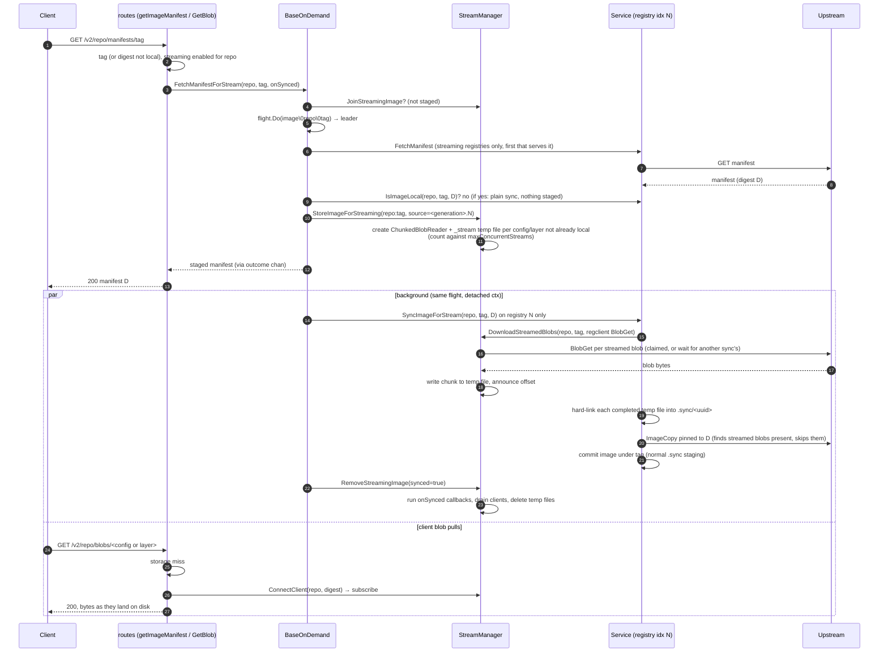
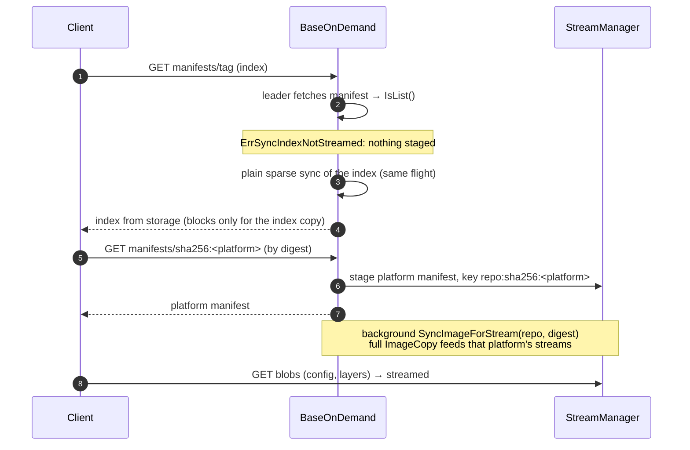

# Streaming on-demand sync design

How zot serves an on-demand image to a client **while it is still downloading** from upstream,
instead of making the client wait until the whole image is committed locally.

Without streaming, a manifest miss blocks in `SyncImage` until every blob is copied and committed,
then serves from storage. With streaming, zot fetches the upstream manifest, returns it right away,
and syncs the image in the background. The client's blob GETs are served from that sync's
in-flight downloads.

Goals:

- One upstream copy per `repo:reference`, shared by every concurrent client.
- A client is only ever fed bytes of the manifest it was served, from the registry that served it.
- Whenever streaming can't be set up, fall back to the plain on-demand path. It is always correct.

## Configuration

Per `extensions.sync.registries[]` entry:

| Field | Meaning |
|-------|---------|
| `stream: true` | Stream this registry's on-demand images. Requires `onDemand`, `https` URLs. Incompatible with `onDemandInBackground`, `maxRetries`/`retryDelay` and `tlsVerify: false`. |
| `maxConcurrentStreams` | Cap on **distinct blobs** streaming at once (default 32). There is one stream manager for all streaming registries, so the cap is shared and every streaming entry must agree on it. |

Example (full file: `examples/config-sync-streaming.json`; on S3/Azure/GCS also set
`extensions.sync.downloadDir`):

```json
"registries": [{
  "urls": ["https://registry-1.docker.io"],
  "onDemand": true,
  "stream": true,
  "maxConcurrentStreams": 32
}]
```

`preserveDigest` is not needed: it is deprecated and ignored, and sync never converts a manifest,
so the streamed manifest always matches what gets committed.

If an `onDemandInBackground` entry also matches the repo, it wins: the repo gets a 404 plus a
queued sync and is never streamed.

### Staging disk sizing

A streamed blob is on the staging disk **once** while its sync runs: the background sync downloads
it into its `_stream/` temp file, which serves clients, and then hard-links that file into the
`.sync/<uuid>` session it commits from (see [On-disk layout and cleanup](#on-disk-layout-and-cleanup)).
The staging disk is the store's root dir on local storage, or `extensions.sync.downloadDir`,
which S3, Azure and GCS deployments must set. So:

- Size the staging disk as for plain on-demand sync: about **1× the total size of the images
  being synced at once**. A single 20GiB layer needs about 20GiB of scratch space. On local
  storage the image's committed copy lands on the same disk too, so leave room for it as well.
- `maxConcurrentStreams` caps how many blobs can have a `_stream/` file at once: at most
  `maxConcurrentStreams` × the largest blob. A torn-down stream keeps its slot while its clients
  drain, until its file is deleted, so this holds under churn too.
- The file is freed once the sync commits and the stream's clients drain. A crash leaves
  `_stream/` files behind until the next start (see below).
- If the link fails (a stream shared with a repo whose staging root is on another filesystem),
  the file is copied instead, and that blob takes the disk twice.

## Components

| Piece | Role |
|-------|------|
| `BaseOnDemand.FetchManifestForStream` | Entry point from `getImageManifest`. Decides: join, lead a streaming sync, or fall back. |
| `ChunkingStreamManager` | Holds the staged manifests (`streamingRefs`) and one `ChunkedBlobReader` per blob (`activeStreams`, keyed by source registry + digest, ref-counted). |
| `ChunkedBlobReader` | One per streamed blob. The sync that claims it reads the blob from upstream (regclient `BlobGet`) through it, writing each chunk to a temp file and announcing the new offset to subscribed clients. |
| `InFlightBlobCopier` | One per client blob GET. Copies what is on disk, then follows new offsets until the blob is complete. |
| `SyncImageForStream` (`StreamSyncer`) | The background sync. Like `SyncImage`, but pinned to the staged digest, and it downloads the streamed blobs itself before `ImageCopy` (`FeedStreams`, `DownloadStreamedBlobs`). |

## Single-arch workflow



Notes:

- **Blob GET before its download starts.** regclient queues blob GETs behind its per-host limit
  (`reqConcurrent`), so a client may subscribe before that blob's download starts. The copier
  waits until it starts, the client disconnects, or teardown's `Abort` (the sync itself is
  bounded by `syncTimeout`).
- **Blob GET after commit.** The sync commits a blob before its stream is torn down. A GET that
  finds neither storage nor a stream rechecks storage. `HEAD` and `Range` GETs follow the same
  order. A range is served from the stream only for a single range; a multi-range request gets
  the whole blob.
- **Blobs already in the repo.** Staging gives no stream to a blob `repo` itself already stores
  (typically a base layer shared with an image pulled earlier). The streamed sync seeds such blobs
  from local storage like any other on-demand sync (`shouldSeedRef`/`seedRef`), so `ImageCopy`
  skips them and nothing downloads them, and the blob routes serve them from storage
  before looking at streams. They don't count against `maxConcurrentStreams`.
- **Pinning.** The background sync runs only on the registry that supplied the manifest (index N)
  and fetches digest D rather than re-resolving the tag. Bytes reach clients before the digest
  is verified, so they must come from the same registry and the same manifest the client was
  served. That holds even when several `registries[]` entries match the repo or the tag moves
  upstream meanwhile. Stream keys include the source for the same reason. A blob staged under
  one repo from two different sources is not streamed at all.
- **Repo scoping.** `ConnectClient` only serves a digest that belongs to a manifest staged under
  the requested repo, so a client authorized for repo B can't read repo A's in-flight blob by
  guessing its digest.
- **Download stats.** The streamed manifest has no metadata until the sync commits, so
  `GetManifest` counts the download in `onSynced` rather than at response time.
- **Failure.** If the producer fails partway, subscribed clients are cut off: the response is
  already a 200, so the client sees a truncated body and retries. New GETs are refused a dead
  stream and fall through to storage. The sync error is returned to the flight. No background
  retry is scheduled (a streaming registry can't set `maxRetries`/`retryDelay`); the next client
  pull starts a fresh on-demand attempt.

## Concurrency: one sync per `repo:reference`

Streaming runs as the leader of the **same singleflight key** `SyncImage` uses
(`image\0repo\0reference`). There is never a second, streaming-only sync. A request in
`FetchManifestForStream` takes the first case that applies:

| State when the request arrives | Result |
|--------------------------------|--------|
| `repo:reference` already staged | Join it: get the staged manifest, register `onSynced`. Streamed. |
| A streaming leader is still fetching/staging | Wait for it to stage, then join as above. Every streaming request registers the per-key `staging` channel *before* entering the flight, and the leader closes that same channel once staged, so this also covers a request that entered the flight just after the leader did. |
| Any other flight in progress (plain `SyncImage`, background retry, a leader that fell back) | Join that flight, wait for it to finish, get `ErrSyncNotStreamed`, serve from storage. **Not streamed.** |
| Nothing in flight | Become leader: stage and stream, or fall back (below). |

So a request is only streamed when it, or a streaming leader it joins, starts the sync.

## Non-streaming fallback

The leader runs the plain on-demand sync (`syncImage`, unpinned, every matching registry) inside
the same flight, and the caller serves from storage exactly as after `SyncImage`, when:

| Cause | Detail |
|-------|--------|
| Already local at the upstream digest | `ErrSyncImageAlreadyLocal`. A re-pull of an unchanged tag (every one, with the default `manifestCheckInterval` of 0) has nothing to download, so it holds no streams. The plain sync skips the copy (`CanSkipImage`) and records the upstream check. |
| Manifest is an index | `ErrSyncIndexNotStreamed`, see multi-arch below. |
| `maxConcurrentStreams` reached | Staging would add more distinct blobs than the cap allows. Blobs already streaming (shared layers) don't count again. Any streams this request had prepared are released. |
| No streaming registry serves the manifest | The plain sync then also tries non-streaming registries. |
| Storage error checking the local image | Upstream's manifest is not served over a storage failure; the plain sync and the local read surface it (503/500). |
| Staging fails otherwise | e.g. unreadable manifest. |

A failed streaming sync is retried in the background unpinned and unstreamed. By then the streams
are gone.

## Multi-arch

On `main`, on-demand multi-arch is already sparse: the tag GET syncs the index alone (root
only), and each platform manifest the client then GETs by digest is a separate, independent
on-demand sync (see [README_sparse_multiarch_sync.md](README_sparse_multiarch_sync.md)).
Streaming keeps exactly that model:



- **The index GET stages and feeds nothing.** Its sync copies only the index, so there are no
  blobs to stream, and blocking on it costs one small manifest copy.
- **Each platform manifest GET owns its own streaming flight**, keyed by its digest, exactly as
  it owns its own plain sync on `main`. Platforms pulled concurrently stage independently. A
  layer shared between them has one stream (same source + digest), ref-counted, and one
  download: the first sync to claim it downloads it, the others wait and link the same file.
- Digest pulls skip `onlySigned`, as on `main`.

## On-disk layout and cleanup

The staging root is the same one plain on-demand sync uses: the store's root dir for local
storage, or `extensions.sync.downloadDir` when set (required for S3/Azure/GCS).

```text
<staging root>/
├── <repo>/
│   └── .sync/<uuid>/...                    # plain sync session (regclient OCI layout); reaped by mtime
└── _stream/
    └── <algorithm>/<encoded digest>.<rand> # one temp file per active stream
```

- `_stream/` sits beside the repos, **not** inside a `.sync/<uuid>` session. That keeps the
  session reaper, which deletes `.sync/<uuid>` dirs by age, away from a live stream's file. A
  repo name can't start with `_`, so the directory never collides with a repo.
- `<rand>` is `os.CreateTemp`'s unique suffix. A digest torn down and re-staged right away never
  shares a file with the old reader while that reader's clients are still draining.
- The streaming sync still commits through its normal `.sync/<uuid>` session. Each completed temp
  file is hard-linked into the session at `blobs/<algorithm>/<encoded digest>`, where regclient's
  `ImageCopy` finds it present and skips the download, so the blob is on local disk once. The
  temp file and the session can be removed in either order: the data goes with the last name. A
  blob whose stream failed is not linked; `ImageCopy` downloads it as usual.
- **Removal:** when the leader's sync ends (success or failure), `RemoveStreamingImage` unstages
  `repo:reference` and drops one reference from each of its streams. For each stream that
  reaches zero references, it calls `Abort` (wakes waiters, fails clients of an unfinished
  download), waits for its clients to disconnect, then deletes the temp file. The streams drain
  concurrently against one 30s deadline (`streamDrainTimeout`) for the whole image, after which
  remaining clients are cut off. Teardown runs inside the reference's flight, so the next request
  for it waits at most 30s on stalled clients, however many blobs they hold. A stream shared with
  another staged reference stays until that reference is removed too.
- **After a crash or kill:** teardown never runs, so the temp files stay. On the next start,
  `Controller.Init` removes `_stream/` under every staging root (`gc.RemoveStreamTempDirs`),
  before sync is enabled. No stream outlives its process, so everything there is an orphan. A
  config reload does not sweep: it keeps the stream manager (resizing `maxConcurrentStreams`),
  whose streams may still be serving clients. Until the restart, orphans use disk under the
  staging root; operators may delete `_stream/` by hand while zot is stopped.
- **Config reload:** a reload never drops the stream manager. It is reused (with the new
  `maxConcurrentStreams`) while some registry streams, and kept as is if none does or sync is
  turned off. Streams staged before the reload keep being fed by their syncs and served by the
  blob routes, which ask the manager whether a repo has streams rather than the new config. A
  manifest request for a reference still staged joins that stream (`FetchManifestForStream`),
  even if the repo no longer streams or is now `onDemandInBackground`, rather than starting a
  second sync of the same tag beside it: that would download it twice, and if the tag moved
  upstream, the older sync, pinned to the digest it served, could commit last and roll the tag
  back. The same holds if the pre-reload flight stages the reference just after a new flight's
  join check: the new flight serves that staged manifest and waits for its sync instead of
  syncing too. New streams are only staged for repos a streaming registry matches.

  In short, a reload guarantees two things for streams already in flight: clients already served
  their manifest still get its blobs, and no second sync of the same reference runs beside them.
  It does not keep serving those streams to new manifest requests once sync is turned off: no
  new sync can start then, and such requests get local content (or 404) until the in-flight sync
  commits, as if sync had been off all along.
- **Lifetime summary:** a temp file lives from staging until its last reference is removed and
  its clients drain (normal case), or until the next zot start (after a crash or kill).
